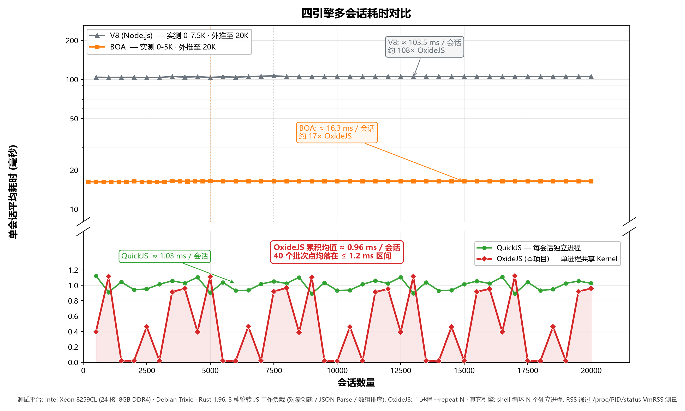
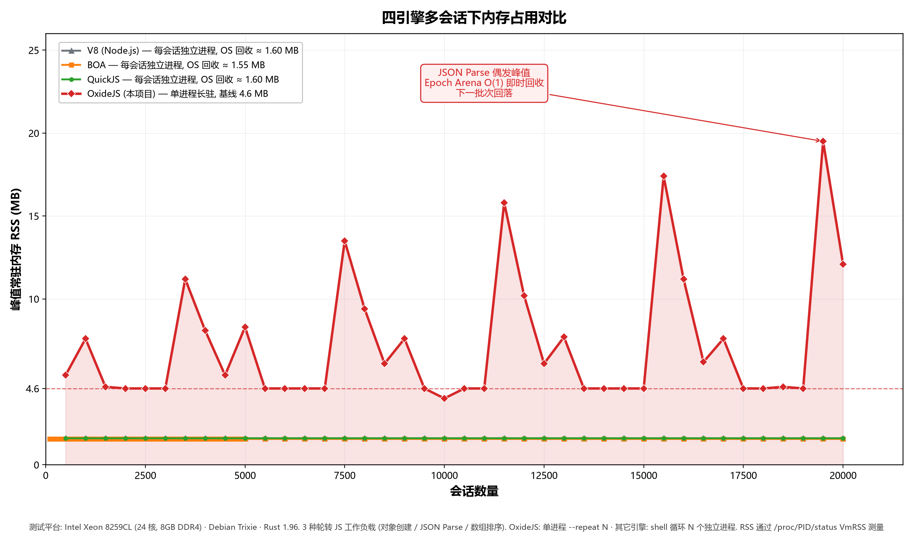
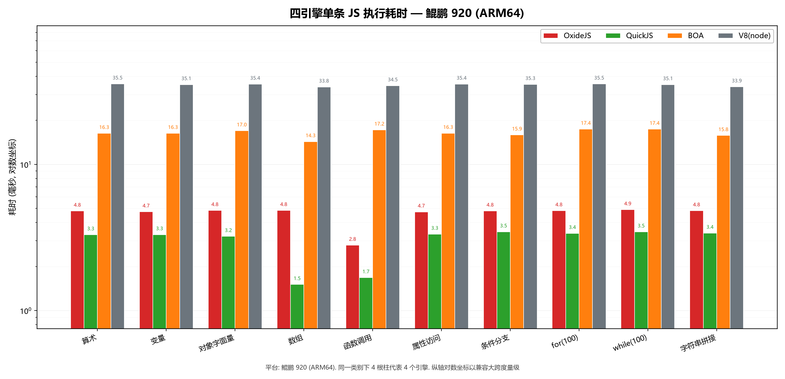
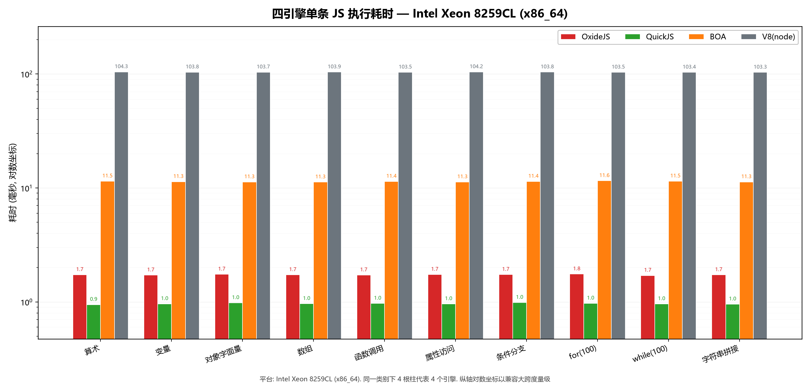
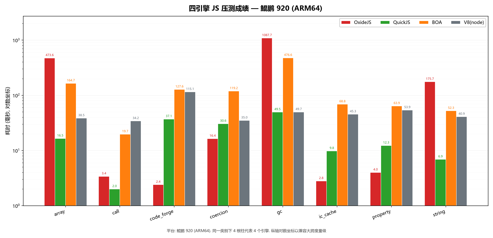
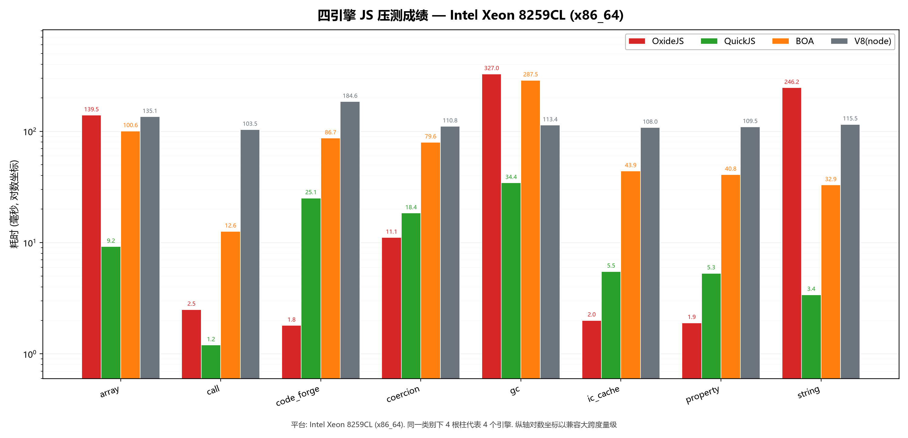

# 面向 AI Agent 的轻量级 JavaScript 执行引擎设计方案文档

> 队名：爱特每羊队（T2026104239910027）
> 团队成员：古宇恒、彭俊皓、杜文韬
> 项目名称：OxideJS
> 技术路线：Rust + 自研字节码编译器 + 寄存器式虚拟机 + 单 Kernel 多 VM 运行时

---

## 一、设计思路

### 1.1 问题背景

在 AI Agent、自动化工具调用、脚本沙箱和数据转换流水线中，JavaScript 代码的执行模式与传统浏览器场景不同：

- **执行时间短**：单次脚本通常只执行一个表达式、一段数据处理逻辑或一次工具调用；
- **调用频率高**：Agent 可能连续发起大量短脚本执行请求；
- **代码结构重复**：由大模型生成的代码往往存在相似模板；
- **上下文隔离要求高**：不同请求需要独立寄存器、调用栈、临时对象和异常状态；
- **公共信息可复用**：字符串、对象 Shape、内置对象、编译缓存等可以跨请求复用；
- **不适合重量级 Runtime**：传统 JS 引擎面向浏览器或长期运行应用，启动、GC、上下文管理都较重。

因此，OxideJS 的设计核心不是简单复刻浏览器 JavaScript 引擎，而是围绕“**轻量、可复用、可隔离、可测试**”四个目标，构建面向短时执行场景的 JS runtime。

### 1.2 总体设计目标

OxideJS 的总体目标是实现一个基于 Rust 的轻量级 JS 执行引擎，提供完整的源码解析、字节码编译、虚拟机执行和兼容性测试链路。

设计目标如下：

| 目标         | 说明                                                            |
|------------|---------------------------------------------------------------|
| 轻量执行与跨平台   | 保证在各个平台都能流畅快速的运行                                              |
| 多请求隔离      | 每个 VM 拥有独立寄存器、调用栈、临时内存和异常状态                                   |
| 跨 VM 复用    | Kernel 保存字符串、Shape、编译缓存、内置对象等共享状态                             |
| 低 GC 干扰    | 临时对象优先进入会话 arena，减少短时执行中的全局回收压力                               |
| test262 驱动 | 使用 ECMAScript Test Suite 持续验证语义正确性                            |
| 可扩展架构      | parser、compiler、types、kernel、vm、cli、test262 runner 分 crate 组织 |

### 1.3 创新点 1: 单 Kernel 多 VM

OxideJS 最重要的运行时结构是 **单 Kernel 多 VM**。

```text
                         Process / Engine Instance

+===================================================================================+
|                                  OxideKernel                                      |
|                                                                                   |
|  分为两层:  KernelCore (immutable, 跨请求永久共享)                                  |
|             KernelSession (per-session, 通过 full_reset() 完全重建)                |
|                                                                                   |
|  ┌── KernelCore (Arc<KernelCore>) ─────────────────────────────────────────┐    |
|  | +----------------+  +----------------+  +----------------+  +----------+ |    |
|  | |  PermInterner  |  |   ShapeForge   |  |    CodeForge   |  | PropForge| |    |
|  | |----------------|  |----------------|  |----------------|  |----------| |    |
|  | | append-only key|  | hidden classes |  | bytecode cache |  | shape→slot| |   |
|  | | leaked &'static|  | property layout|  | LRU 缓存       |  | IC 模板   | |   |
|  | | 64-bit hash    |  | shape graph    |  | structural hash|  |          | |    |
|  | +----------------+  +----------------+  +----------------+  +----------+ |    |
|  | KernelConfig (pool / step / max_cached_modules / log levels)             |    |
|  └──────────────────────────────────────────────────────────────────────────┘    |
|                                                                                   |
|  ┌── KernelSession (per-session) ──────────────────────────────────────────┐    |
|  | BuiltinWorld    |  Global object   |  BuiltinSnapshot                    |    |
|  | Object/Array/   |  全局对象与基础  |  脏检测 + 选择性重建                  |    |
|  | Function/...    |  属性            |                                     |    |
|  └─────────────────────────────────────────────────────────────────────────┘    |
+==========================================+========================================+
                                           |
                                           | Arc<KernelCore>  +  KernelSession
                                           |
           +-------------------------------+-------------------------------+
           |                               |                               |
           v                               v                               v
+----------------------+        +----------------------+        +----------------------+
|        VM #1         |        |        VM #2         |        |        VM #N         |
|----------------------|        |----------------------|        |----------------------|
| registers[256]       |        | registers[256]       |        | registers[256]       |
| pc                   |        | pc                   |        | pc                   |
| bytecode             |        | bytecode             |        | bytecode             |
| immutables_cache     |        | immutables_cache     |  ....  | immutables_cache     |
| frames (SmallVec)    |        | frames (SmallVec)    |        | frames (SmallVec)    |
| save_stack (共享)    |        | save_stack (共享)    |        | save_stack (共享)    |
| try / except state   |        | try / except state   |        | try / except state   |
| Epoch Arena (会话)   |        | Epoch Arena (会话)   |        | Epoch Arena (会话)   |
| JsString GC + roots  |        | JsString GC + roots  |        | JsString GC + roots  |
| object_prototype     |        | object_prototype     |        | object_prototype     |
+----------+-----------+        +----------+-----------+        +----------+-----------+
           |                               |                               |
           v                               v                               v
    Request Result                  Request Result                  Request Result
```

说明:

- **PermInterner** 取代了早期的 `StringForge`: 它只 intern **key / identifier / method name** 等永不释放的字符串, 用 leaked `&'static str` + 64-bit hash 索引, 没有 ref-count 也没有 maybe_sweep 重编号路径, 因而无锁读、零冲突;
- **运行时 JsString 值** (用户代码里 `"hello" + name` 产出的临时字符串) 不在 Kernel, 而是由各 VM 自带的 **JsString 标记清扫 GC** 管理 (commit `fe2d492`), 配合 Epoch Arena 实现短命对象 O(1) 回收;
- **KernelCore vs KernelSession** 的拆分让 test262 runner 可以在不丢弃编译缓存 / Shape 图 / Property IC 模板的前提下, 通过 `full_reset()` 重建 BuiltinWorld 与 global object, 实现测试间完全隔离 (commit `d242d08`)。

该结构将运行时状态分为两类：

| 状态类型 | 所在位置 | 生命周期 | 示例 |
|----------|----------|----------|------|
| 永久共享状态 | `KernelCore` | 进程级、永不释放 | PermInterner (key/identifier)、ShapeForge、CodeForge、PropForge |
| 会话级共享状态 | `KernelSession` | 测试 / 会话级、可 `full_reset()` 重建 | BuiltinWorld、global object、BuiltinSnapshot |
| 请求私有状态 | `Vm` | 请求级、短生命周期 | 寄存器、PC、调用栈、异常、Epoch Arena、JsString GC 根 |

这种分层使得 OxideJS 能够同时满足两类需求：

1. **隔离性**：每个 VM 独立执行，不共享寄存器和临时对象；
2. **复用性**：多个 VM 共享 Kernel，避免重复构建字符串、Shape、内置对象和编译结果。

### 1.4 创新点 2: 短生命周期内存与 GC

AI Agent 场景中的大部分对象具有明显的短生命周期特征：对象在一次脚本执行中创建，在执行结束后立即失效。OxideJS 因此将运行时内存分为多个层级：

```text
+====================================================================================+
|                                Memory Model                                        |
+====================================================================================+

  Long-lived / shared memory
  ┌──────────────────────────────────────────────────────────────────────────────┐
  │ KernelCore  (Arc<KernelCore>, 进程级永久共享)                                  │
  │                                                                              │
  │  PermInterner   ShapeForge      CodeForge       PropForge                    │
  │  append-only    hidden classes  bytecode LRU    IC 模板                       │
  │  key / ident    shape graph     structural hash shape→slot                   │
  │                                                                              │
  │  生命周期: 随进程存活, 表结构 append-only, 永不释放                              │
  └──────────────────────────────────────────────────────────────────────────────┘
  ┌──────────────────────────────────────────────────────────────────────────────┐
  │ KernelSession  (per-session, 可通过 full_reset() 重建)                        │
  │                                                                              │
  │  BuiltinWorld   Global object   BuiltinSnapshot                              │
  │  Object/Array/  全局对象        脏检测 + 选择性重建                              │
  │  Function/...                                                                │
  │                                                                              │
  │  生命周期: 单次 session, 测试隔离时通过 full_reset() 完全重建                     │
  └──────────────────────────────────────────────────────────────────────────────┘
                                      ▲
                                      │ shared references
                                      │
  Per-VM / per-session memory         │
  ┌───────────────────────────────────┴──────────────────────────────────────────┐
  │ Vm                                                                           │
  │                                                                              │
  │  registers[256] / call frames (SmallVec) / try-catch / exception state       │
  │                                                                              │
  │  +----------------------------+                                              │
  │  | Epoch Arena                |  bump allocation, O(1) epoch 回收             │
  │  |----------------------------|                                              │
  │  | object allocations         |                                              │
  │  | arrays / temporary values  |                                              │
  │  | execution-local metadata   |                                              │
  │  +----------------------------+                                              │
  │                                                                              │
  │  +----------------------------+                                              │
  │  | JsString GC                |  标记清扫, 管理运行时 JsString 值              │
  │  |----------------------------|                                              │
  │  | tracked allocations        |                                              │
  │  | roots from registers       |                                              │
  │  | roots from frames          |                                              │
  │  | GC 阈值: 32 MB (commit ad7b044)                                            │
  │  +----------------------------+                                              │
  │                                                                              │
  │  生命周期: 单 VM / 单执行会话, 执行结束后 Epoch 翻页, GC 标记清扫批量释放          │
  └──────────────────────────────────────────────────────────────────────────────┘
```

内存与 GC 设计的关键点：

- **短命对象进入 VM 本地 Epoch Arena**: bump allocation, 整个 epoch 翻页时 O(1) 回收, 不参与逐对象扫描;
- **VM 拥有自己的 JsString GC**: 运行时字符串 (`"hello" + name` 等) 由标记清扫 GC 管理, 寄存器 / 调用栈 / 异常对象 / Map/Set/Array 容器都作为 root, GC 阈值 32 MB 触发 (commit `ad7b044`);
- **永久状态与会话状态分层**: `KernelCore` 持有 PermInterner / Shape / Code / Prop 等长生命周期表, `KernelSession` 持有可重建的 BuiltinWorld 与 global object;
- **测试 / 短会话隔离**: 通过 `KernelSession::full_reset()` + `BuiltinSnapshot` 脏检测可以在不丢弃编译缓存的前提下重建 builtin 与全局对象;
- **Map / Set / Array / Object 等容器参与 GC 追踪**: 防止 session 对象在容器中被错误释放 (commit `9db28b2` 修过 Map/Set GC 追踪丢失问题)。

### 1.5 创新点 3: 自研字节码与寄存器式 VM

OxideJS 不直接解释 AST，而是先将 AST 编译为自定义字节码，再由寄存器式 VM 执行。

```text
 AST
  |
  | compiler pass
  v
+-------------------------------+
|        CompiledModule         |
|-------------------------------|
| bytecode: Vec<Instr>          |
| constants: Vec<Constant>      |
| n_registers                   |
| sub_modules for functions     |
+-------------------------------+
  |
  | run(module)
  v
+-------------------------------+
|              VM               |
|-------------------------------|
| r0 r1 r2 ... r255             |
| pc                            |
| frames                        |
| current bytecode              |
| current constants             |
+-------------------------------+
```

采用寄存器式 VM 的原因：

- 表达式中间结果可以直接保存在寄存器中；
- 对象属性访问和函数参数传递更直接；
- 相比栈式 VM，减少大量 push/pop 指令；
- 便于后续加入类型反馈、inline cache 和局部优化。

---

## 二、实现描述

### 2.1 完整工作流程

OxideJS 的一次执行请求从输入 JS 源码到返回结果，经过以下流程：

```text
┌────────────────────────────────────────────────────────────────────────────────────┐
│                              One Evaluation Request                                │
└────────────────────────────────────────────────────────────────────────────────────┘

  1. Source Input
     │
     │  JavaScript source string / file
     ▼
┌───────────────────────┐
│ oxide_parser          │
│-----------------------│
│ - create allocator    │
│ - parse source        │
│ - produce AST Program │
└──────────┬────────────┘
           │ AST
           ▼
┌────────────────────────────────────────────────────────────────────────────────────┐
│ oxide_compiler                                                                     │
│------------------------------------------------------------------------------------│
│                                                                                    │
│  Pass 1: counter / symbol projection                                               │
│    - walk statements and expressions                                               │
│    - allocate registers                                                            │
│    - assign labels for jumps, loops, try/catch, switch                             │
│    - build lexical binding information                                             │
│                                                                                    │
│  Pass 2: emitter                                                                   │
│    - emit fixed-width bytecode                                                     │
│    - build constant pool                                                           │
│    - compile function bodies into sub-modules                                      │
│    - encode property access / call / control-flow instructions                     │
│                                                                                    │
│  Hash: structural_hash                                                             │
│    - normalize AST structure                                                       │
│    - generate cache key for CodeForge                                              │
│                                                                                    │
└──────────┬─────────────────────────────────────────────────────────────────────────┘
           │ CompiledModule
           ▼
┌────────────────────────────────────────────────────────────────────────────────────┐
│ KernelCore.CodeForge                                                               │
│------------------------------------------------------------------------------------│
│  if cache hit:                                                                      │
│      reuse Arc<CompiledModule>                                                     │
│  else:                                                                             │
│      insert newly compiled module                                                  │
└──────────┬─────────────────────────────────────────────────────────────────────────┘
           │ Arc<CompiledModule>
           ▼
┌────────────────────────────────────────────────────────────────────────────────────┐
│ VmPool / VM Selection                                                              │
│------------------------------------------------------------------------------------│
│  - obtain an idle VM                                                               │
│  - VM references the same Arc<OxideKernel>                                         │
│  - reset request-local state                                                       │
│  - prepare registers, bytecode, constants, frames                                  │
└──────────┬─────────────────────────────────────────────────────────────────────────┘
           │
           ▼
┌────────────────────────────────────────────────────────────────────────────────────┐
│ VM Dispatch Loop                                                                   │
│------------------------------------------------------------------------------------│
│  while pc < bytecode.len():                                                        │
│      instr = bytecode[pc]                                                          │
│      decode opcode / rd / a / b                                                    │
│      dispatch opcode                                                               │
│                                                                                    │
│      examples:                                                                     │
│        LOAD_CONST    -> load constant to register                                  │
│        ADD / SUB     -> numeric or string operation                                │
│        GET_PROP      -> property lookup through Shape / object model               │
│        CALL          -> push CallFrame and enter sub-module                        │
│        CALL_NATIVE   -> call Rust builtin                                          │
│        THROW         -> build exception and unwind                                 │
│        RETURN        -> restore caller frame                                       │
│        HALT          -> finish execution                                           │
└──────────┬─────────────────────────────────────────────────────────────────────────┘
           │ JsValue
           ▼
  6. Result Formatting / API Return
```

### 2.2 Parser 层

Parser 层负责将 JavaScript 源码转换为 AST。它不承载运行时语义，而是为 compiler 提供标准化输入。

职责：

- 接收源码字符串；
- 创建 AST allocator；
- 调用 parser 得到 Program；
- 将 parser error 转换为项目内部错误。

对应模块：

```text
crates/oxide_parser/
├── src/lib.rs
└── src/error.rs
```

### 2.3 Compiler 层

Compiler 层是 AST 到字节码的核心转换阶段。

```text
crates/oxide_compiler/src/
├── compiler.rs       # 编译入口和上下文
├── counter.rs        # 第一遍：寄存器、标签、符号统计
├── emitter.rs        # 第二遍：生成字节码
├── hash.rs           # structural hash，用于 CodeForge 缓存
├── module.rs         # CompiledModule / Constant
├── opcode.rs         # OpCode 和 32-bit 指令编码
└── symbol_table.rs   # 词法绑定与作用域信息
```

#### 2.3.1 两遍编译

第一遍编译搞清：

- 函数需要多少寄存器；
- 跳转标签位置；
- 局部变量和词法绑定；
- control-flow 结构边界；
- 函数子模块结构。

第二遍编译正式工作：

- 将表达式编译为寄存器操作；
- 将控制流编译为跳转；
- 将对象/数组字面量编译为构造指令；
- 将函数体编译为子模块；
- 将常量写入常量池。

#### 2.3.2 字节码格式

OxideJS 使用固定 32-bit 指令：

```text
32-bit Instr

+----------+----------+----------+----------+
| opcode   | rd       | a        | b        |
+----------+----------+----------+----------+
  8 bits    8 bits     8 bits     8 bits
```

其中：

- `opcode` 表示操作类型；
- `rd` 通常表示目标寄存器；
- `a` / `b` 表示源寄存器、立即数低高位或其他操作数。

主要操作码类别：

| 类别 | 示例 |
|------|------|
| 算术 | ADD、SUB、MUL、DIV、MOD |
| 位运算 | BIT_AND、BIT_OR、BIT_XOR、SHL、SHR |
| 比较 | EQ、STRICT_EQ、LT、GTE |
| 控制流 | JMP、JMP_IF_FALSE、SWITCH_TABLE |
| 异常 | THROW、TRY_BEGIN、TRY_END |
| 变量 | LOAD_VAR、STORE_VAR、LOAD_CONST |
| 函数 | CALL、RETURN、CALL_NATIVE |
| 对象 | NEW_OBJECT、GET_PROP、SET_PROP |
| 数组 | NEW_ARRAY、SET_ELEM |
| 成员更新 | MEMBER_INC、COMPOUND_MEMBER_ADD 等 |
| 结束 | HALT |

### 2.4 VM 层

VM 是字节码执行核心。每个 VM 是一个独立执行上下文。

```text
+------------------------------------------------------------------------------------+
|                                      Vm                                            |
+------------------------------------------------------------------------------------+
| registers[256]        固定寄存器文件                                                  |
| pc                    当前程序计数器                                                  |
| bytecode              当前执行字节码                                                  |
| constants             当前常量池                                                     |
| frames                函数调用栈                                                     |
| try_stack             异常处理栈                                                     |
| exception_value       当前异常值                                                     |
| pending_error_kind    当前错误类型                                                    |
| for_in_iters          for-in 迭代状态                                                |
| session_arena         短生命周期对象分配区                                             |
| session_gc            当前 VM 的 session GC 元数据                                    |
| kernel: Arc<Kernel>   指向共享 Kernel                                                |
+------------------------------------------------------------------------------------+
```

VM 的执行循环大致如下：

```text
loop:
    instr = bytecode[pc]
    pc += 1

    match opcode(instr):
        LOAD_CONST  => regs[rd] = constants[idx]
        ADD         => regs[rd] = add(regs[a], regs[b])
        GET_PROP    => object property lookup
        SET_PROP    => object property write
        CALL        => push frame and enter function
        CALL_NATIVE => call Rust builtin function
        RETURN      => restore caller frame
        THROW       => unwind try stack
        HALT        => return regs[0]
```

### 2.5 Kernel 层

Kernel 是单进程内的共享运行时核心。它不保存某一次执行请求的寄存器和调用栈，而是保存可跨请求复用的结构。Kernel 内部进一步拆分为两层 (commit `d242d08`):

- **KernelCore**: 进程级永久共享, 表结构 append-only, 永不重建;
- **KernelSession**: 测试 / 会话级, 可通过 `full_reset()` 配合 `BuiltinSnapshot` 脏检测实现选择性重建。

```text
+------------------------------------------------------------------------------------+
|                                  OxideKernel                                       |
+------------------------------------------------------------------------------------+
| ── KernelCore (Arc<KernelCore>, 跨请求永久共享) ──────────────────────────────────  |
| KernelConfig                                                                       |
| PermInterner    Append-only key / identifier 驻留 (leaked &'static str, 64-bit hash)|
| ShapeForge      全局 Shape / Hidden Class 表                                        |
| CodeForge       编译结果缓存 (Mutex<LruCache>, max_cached_modules 上限)              |
| PropForge       属性访问 IC 模板 / shape→slot 缓存                                   |
|                                                                                    |
| ── KernelSession (per-session, 可 full_reset() 重建) ──────────────────────────────  |
| BuiltinWorld    Object / Array / Function / String / Number 等内置对象结构          |
| Global object   全局对象及其基础属性                                                  |
| BuiltinSnapshot 脏检测快照, 支撑选择性重建                                            |
+------------------------------------------------------------------------------------+
```

#### 2.5.1 单 Kernel 多 VM 的执行优势

| 问题 | 普通每 VM 独立 runtime | OxideJS 单 Kernel 多 VM |
|------|------------------------|--------------------------|
| 内置对象初始化 | 每个 VM 重复构造 | KernelSession 中集中构造与复用 |
| Key / identifier 驻留 | 每个 VM 各自保存 | PermInterner 全局 append-only, 无锁读 |
| 对象 Shape | 每个 VM 重复生成 | ShapeForge 跨 VM 共享 |
| 编译结果 | 每次请求重新编译 | CodeForge 按 structural hash 缓存复用 |
| 属性访问模板 | 每个 VM 冷启动 | PropForge 跨 VM 共享 IC 模板 |
| 请求隔离 | 需要小心拆分 | VM 自带寄存器、栈、Epoch Arena、JsString GC, 天然隔离 |
| 测试间重置 | 整个 runtime 销毁重建 | `KernelSession::full_reset()` 重建 builtin + global, 保留缓存 |

#### 2.5.2 多 VM 执行示例

```text
Request A: "items.map(x => x.id)"
Request B: "users.map(u => u.name)"
Request C: "orders.map(o => o.price)"

              +-------------------+
              |  OxideKernel      |
              |  (Core + Session) |
              |-------------------|
              | CodeForge         |  结构相似代码命中编译缓存
              | ShapeForge        |  相似对象布局共享 Shape
              | PermInterner      |  id / name / price 等 key 驻留
              +---------+---------+
                        |
        +---------------+---------------+
        |               |               |
        v               v               v
     VM #1           VM #2           VM #3
   Request A       Request B       Request C

   各 VM 私有: 寄存器 / Epoch Arena / JsString GC / 异常状态
```

### 2.6 对象模型与属性访问

对象通过 Shape 描述属性布局。

```text
EMPTY_SHAPE
    |
    | add "x"
    v
Shape #2: property="x", offset=0
    |
    | add "y"
    v
Shape #3: property="y", offset=1
```

对象自身保存：

- 当前 Shape ID；
- 原型指针；
- 属性存储区；
- 函数 / 数组等标志位；
- native 函数指针或子模块索引。

属性访问流程：

```text
GET_PROP obj, key
    |
    | 1. 读取对象 shape_id
    | 2. 查询属性 key 对应 offset
    | 3. 命中 Shape / PropForge 缓存则直接取 slot
    | 4. 未命中则沿原型链查找
    v
返回属性值或 undefined
```

### 2.7 内置对象

内置对象由 Rust 原生实现，并通过 Kernel / BuiltinWorld 进行注册。

```text
crates/oxide_vm/src/builtins/
├── array.rs
├── array_buffer.rs
├── boolean.rs
├── data_view.rs
├── date.rs
├── error.rs
├── function.rs
├── global/
├── iterator.rs
├── json.rs
├── map.rs
├── math.rs
├── number.rs
├── object.rs
├── reflect.rs
├── regexp.rs
├── set.rs
├── string.rs
├── symbol.rs
└── typed_array.rs
```

绑定层位于：

```text
crates/oxide_vm/src/bindings/
```

其职责是将 Rust native 函数挂载到对应构造器、原型对象或全局对象上。

### 2.8 test262 Runner

`oxide_test262` 用于自动运行 ECMAScript Test Suite。

```text
+------------------------------------------------------------------------------------+
|                               oxide_test262                                        |
+------------------------------------------------------------------------------------+
|  discover tests                                                                     |
|  parse YAML metadata                                                                |
|  load harness includes                                                              |
|  apply skip / feature policy                                                        |
|  run parser -> compiler -> VM                                                       |
|  catch panic / runtime error                                                        |
|  classify pass / fail / skip                                                        |
|  summarize totals and failure categories                                            |
+------------------------------------------------------------------------------------+
```

runner 的输出可以用于：

- 统计当前兼容性；
- 找出失败最多的语义类别；
- 指导下一阶段实现；
- 对比 QuickJS、Boa、JerryScript 等 baseline。

---

## 三、代码说明

### 3.1 顶层目录

```text
project-root/
├── Cargo.toml
├── Cargo.lock
├── crates/
├── tests/
├── docs/
├── README.md
└── 设计方案文档.md
```

### 3.2 Crate 说明

| Crate | 作用 |
|-------|------|
| `oxide_parser` | JavaScript parser 接入层，输出 AST Program |
| `oxide_compiler` | AST 到字节码的编译器 |
| `oxide_types` | JS runtime 基础类型，如 JsValue、JsObject、Shape、Error、Arena |
| `oxide_kernel` | 单 Kernel 多 VM 架构中的共享运行时核心 |
| `oxide_vm` | 字节码解释器、内置对象、VM pool、session arena / GC |
| `oxide_api` | 对外 API 预留层 |
| `oxide_cli` | 命令行工具，支持 eval / run / compile / REPL |
| `oxide_test262` | test262 自动化测试运行器 |

### 3.3 `oxide_types`

关键文件：

```text
crates/oxide_types/src/
├── value.rs        # JsValue, NaN-boxing 值表示
├── object.rs       # JsObject, 对象头、属性存储、函数/数组标记
├── shape.rs        # Shape, ShapeId, 属性布局信息
├── mem.rs          # P<T>, arena / persistent object 相关基础结构
├── error.rs        # 内部错误类型
└── private_key.rs  # class private field / private name 支持结构
```

该 crate 处于依赖图底层，尽量不依赖上层模块。

### 3.4 `oxide_kernel`

关键文件：

```text
crates/oxide_kernel/src/
├── kernel.rs        # KernelCore + KernelSession + KernelConfig + global object
├── string_forge.rs  # PermInterner — append-only key / identifier 驻留
├── shape_forge.rs   # ShapeForge — Shape / Hidden Class 创建与查询
├── code_forge.rs    # CodeForge — CompiledModule LRU 缓存
├── prop_forge.rs    # PropForge — 属性访问 IC 模板缓存
├── builtin.rs       # BuiltinWorld + BuiltinSnapshot 选择性重建
└── kernel_log.rs    # Kernel 层结构化日志包装
```

`oxide_kernel` 是单 Kernel 多 VM 的中心。它通过 `KernelCore` 保存永久共享状态, 通过 `KernelSession` 保存可重建的会话级状态, 而 VM 保存短期执行状态。

### 3.5 `oxide_compiler`

关键文件：

```text
crates/oxide_compiler/src/
├── compiler.rs      # 编译入口与上下文
├── counter.rs       # 第一遍 AST 遍历，计算寄存器和标签
├── emitter.rs       # 第二遍 AST 遍历，生成字节码
├── opcode.rs        # OpCode 和指令编码
├── module.rs        # CompiledModule / Constant
├── hash.rs          # structural hash
└── symbol_table.rs  # 词法作用域和变量绑定
```

编译器输出 `CompiledModule`，交由 VM 执行或写入 CodeForge 缓存。

### 3.6 `oxide_vm`

关键文件与目录：

```text
crates/oxide_vm/src/
├── vm.rs              # VM 主结构与执行入口
├── vm_runtime.rs      # 运行时入口和状态恢复
├── vm_support.rs      # VM 辅助逻辑
├── vm_props.rs        # 属性访问辅助逻辑
├── vm_pool.rs         # VM pool，多 VM 复用
├── session_arena.rs   # 会话级 arena
├── session_gc.rs      # 会话级 GC / 标记清扫辅助
├── coercion.rs        # ToNumber / ToString / ToBoolean 等类型转换
├── native.rs          # Native function 调用接口
├── dispatch/          # opcode 分发实现
├── builtins/          # 内置对象实现
└── bindings/          # 内置对象绑定到 BuiltinWorld / global object
```

VM 层是代码量最大的模块，包含：

- 字节码 dispatch；
- 函数调用；
- 异常处理；
- 原型链属性访问；
- 内置对象 native call；
- session arena 与 GC；
- VM pool。

### 3.7 `oxide_cli`

关键功能：

```text
cargo run --release -p oxide_cli -- eval "1 + 2"
cargo run --release -p oxide_cli -- run file.js
cargo run --release -p oxide_cli -- run file.js --repeat 1000   # 单进程内复用 Kernel 重跑 N 次
cargo run --release -p oxide_cli -- compile -e "1 + 2"
cargo run --release -p oxide_cli
```

CLI 主要用于：

- 手工运行 JS 片段；
- 打印编译后的字节码；
- 执行文件；
- `run --repeat N`: 单进程内复用 Kernel 连续 eval N 次 (commit `05d0c25`), 用于多会话基准测试;
- 进行 smoke test。

### 3.8 `oxide_test262`

关键文件：

```text
crates/oxide_test262/src/main.rs
```

职责：

- 遍历 test262 测试目录；
- 解析 metadata；
- 注入 harness；
- 根据 feature / flag 进行跳过或执行；
- 捕获 panic；
- 输出 pass / fail / skip；
- 统计失败类别。

### 3.9 代码工作流总结

```text
Developer / CLI / test262
        |
        v
  oxide_parser
        |
        v
  oxide_compiler -----> KernelCore.CodeForge
        |                         |
        v                         |
   CompiledModule <---------------+
        |
        v
  VmPool selects Vm
        |
        v
  Vm executes bytecode -----> KernelCore: PermInterner / ShapeForge / PropForge
                        ----> KernelSession: BuiltinWorld / global object
        |
        v
  JsValue / Error / TestResult
```

### 3.10 创新点到代码快速导航

| 创新点 | 代码位置 | 说明 |
|--------|----------|------|
| 单 Kernel 多 VM | `oxide_kernel::kernel`, `oxide_vm::vm_pool`, `oxide_vm::vm` | Kernel 共享，VM 隔离 |
| Key / identifier 驻留 | `string_forge.rs` (`PermInterner`) | 跨 VM append-only 驻留, 无锁读 |
| 共享 Shape | `shape_forge.rs`, `shape.rs` | 跨 VM 对象布局复用 |
| 编译缓存 | `code_forge.rs`, `hash.rs` | structural hash -> CompiledModule |
| 属性访问缓存 | `prop_forge.rs`, `vm_props.rs`, `dispatch/property.rs` | Shape / offset 快速路径 |
| 会话内存与 GC | `session_arena.rs`, `session_gc.rs`, `vm.rs` | VM 本地短命对象管理 |
| NaN-boxing | `value.rs` | 64-bit 统一值表示 |
| 寄存器式 VM | `opcode.rs`, `vm.rs`, `dispatch/` | 固定寄存器执行模型 |

---

## 主要使用的开源项目与依赖说明

- oxc — JavaScript 源码解析（parser/ast/allocator/span/diagnostics/syntax），全项目最核心的外部依赖
- bumpalo — Bump allocator，构成 `Epoch` arena 内存系统的底层分配器
- dashmap — 并发 HashMap，用于 `CodeForge`、`ShapeForge`、`PropForge` 跨 VM 缓存共享

---

## 四、Benchmark 与评分体系

### 4.1 测试套件设计

在真实场景下，JS 引擎 “好不好用”，并不是只看代码执行的准确率，其运行速度和资源占用情况也非常重要。为此，我们采用了一套多维度的 benchmark 打分体系，针对 AI Agent 场景的特性进行验证：

| 维度 | 测试套件 | 测试项 | 权重 | 说明 |
|------|---------|--------|------|------|
| **正确性** | test262 (ES 标准一致性) | 53,598 个官方测试 | 50% | ECMAScript 官方合规性测试 |
| **性能** | JetStream 2.0 微基准 | 64 个代表性微基准 | 25% | 几何平均相对 QuickJS baseline |
| **启动** | 冷/热启动测量 | `oxide eval "1;"` 20 次 | 15% | Agent 调用响应速度 |
| **内存** | 压力测试峰值 RSS | `tests/stress/*.js` | 10% | 长运行场景内存占用 |

### 4.2 综合评分公式

$$
S_{\text{total}} = 0.50 \cdot S_{\text{correctness}} + 0.25 \cdot S_{\text{perf}} + 0.15 \cdot S_{\text{startup}} + 0.10 \cdot S_{\text{memory}}
$$

#### 4.2.1 正确性得分 (Correctness)

$$
S_{\text{correctness}} = \frac{P_{\text{pass}}}{P_{\text{pass}} + P_{\text{fail}}} \times 100
$$

- $P_{\text{pass}}$: test262 通过测试数 (of ran, 不计 skip)
- $P_{\text{fail}}$: test262 失败测试数
- **目标**: $\geq 60$ (ES2020 核心特性覆盖)
- **当前** (2026-06-30): **pass 率 69.6%**, 已超出 v1.0 里程碑目标

#### 4.2.2 性能得分 (Performance)

基于 JetStream 2.0 几何平均，以 QuickJS 为基准 (80 分 = 持平)：

$$
T_{\text{geo}} = \left( \prod_{i=1}^{n} t_i \right)^{1/n}, \quad
R = \frac{T_{\text{geo}}^{\text{QJS}}}{T_{\text{geo}}^{\text{Oxide}}}, \quad
S_{\text{perf}} = 80 + 20 \cdot \log_2(R)
$$

- $R > 1$: OxideJS 更快
- $R = 1$: 持平 (80 分)
- $R = 0.5$: 慢 2 倍 (60 分)

#### 4.2.3 启动速度得分 (Startup)

$$
S_{\text{startup}} = 100 - \min\left(50, \frac{t_{\text{cold}} - 50}{10}\right) - \min\left(30, \frac{t_{\text{warm}} - 20}{5}\right)
$$

- $t_{\text{cold}}$: 首次执行时间 (ms)，目标 < 100ms
- $t_{\text{warm}}$: 后续 19 次平均 (ms)，目标 < 50ms
- 冷启动每超 10ms 扣 1 分，热启动每超 5ms 扣 1 分

#### 4.2.4 内存占用得分 (Memory)

$$
S_{\text{memory}} = \max\left(0, 100 - \frac{M_{\text{peak}} - 50}{5}\right)
$$

- $M_{\text{peak}}$: 压力测试峰值 RSS (MB)
- 目标: < 150MB 得满分

#### 4.2.5 四引擎综合得分对比

以 QuickJS = 80 为基准, 各引擎按上述四维度加权得到的综合分数:

| 引擎 | 综合得分 |
|------|----------|
| QuickJS | 80 |
| BOA | 69 |
| **OxideJS (本项目)** | **61** |
| V8 (Node.js) | 53 |

OxideJS 当前 61 分, 介于 BOA 与 V8 之间, 主要由 test262 通过率 (69.6%, 仍有 30% 失败) 拖累, 这是我们之后优化的工作重点。

### 4.3 Agent 场景专用加权

针对多轮对话 / 跨 session 缓存：

$$
S_{\text{agent}} = 0.4 \cdot S_{\text{correctness}} + 0.2 \cdot S_{\text{perf}} + 0.2 \cdot S_{\text{session-reuse}} + 0.2 \cdot S_{\text{memory}}
$$

其中 session 复用收益：

$$
S_{\text{session-reuse}} = 100 \cdot \left(1 - \frac{t_{\text{session-N}}}{t_{\text{session-1}}}\right)
$$

衡量 OxideKernel 跨 VM 共享 (DashMap + Arc) 的缓存收益。

### 4.4 Baseline 对比

#### 4.4.1 综合对比表

| 引擎 | test262 pass% | 单条 JS 平均耗时 (ms) | 多会话单次平均 (ms) | 单进程基线 RSS (MB) |
|------|--------------|----------------------|---------------------|---------------------|
| **QuickJS** | ~99% | 0.95 / 3.18 | 1.03 | 1.60 |
| **Boa v0.21** | ~85% | 11.32 / 16.29 | 16.3 | 1.55 |
| **V8 (Node.js)** | ~100% | 103.74 / 34.95 | 103.5 | 1.60 |
| **OxideJS (当前)** | **69.6%** | **1.73 / 4.62** | **0.96** | **4.6** |

> 单条 JS 平均耗时格式: *Intel 8259CL / 鲲鹏 920* (ms), 取自 `benchmark/run_benchmark.py` 的 10 类语句测试均值。

#### 4.4.2 多会话耗时 (4 引擎 0–20K 会话)



在 0–20,000 会话的连续负载下:

- **OxideJS** 单进程共享 Kernel, 累积均值 **0.96 ms / 会话**, 40 个批次点全部落在 ≤ 1.2 ms 区间。
- **QuickJS** 每会话独立进程, ≈ 1.03 ms / 会话, 约为 OxideJS 的 1.07×。
- **BOA** ≈ 16.3 ms / 会话 (≈ 17× OxideJS), 实测至 5K 会话后按稳态斜率外推。
- **V8 (Node.js)** ≈ 103.5 ms / 会话 (≈ 108× OxideJS), 7,500 会话后中止 (单次启停成本过大), 之后按稳态斜率外推。

OxideJS 通过 Kernel + VM Pool 单进程长驻消除了每会话 `fork/exec` 的开销, 是 4 引擎中唯一在 Agent 短会话场景下保持低延迟可持续的方案。
此外，由图中数据可以看出，我们 OxideJS 在面对这类多会话的情况时，依然可以保持快速响应执行，其耗时明显少于其他引擎

#### 4.4.3 多会话内存占用 (峰值 RSS)



- **OxideJS** 单进程长驻, 典型会话 **基线 4.6 MB**; JSON Parse 工作负载偶发出现峰值, 但每次峰值后下一批次立即被 **Epoch Arena O(1) 回收** 至 4.6 MB, 不退化为系统调用。然而内存占用总量依然偏大，内存分配与回收机制仍需改进。
- **QuickJS / V8 / BOA** 每会话独立进程, RSS 由进程边界天然回收, 长期保持 ≈ 1.5–1.6 MB。

考虑到目前的 PC、服务器甚至嵌入式设备的内存并不短缺，在实际体验中反而更注重耗时，因此我们的工作重心主要在解决耗时上，其运行时涉及到许多对象内容的复用，所以我们的方案在内存占用上比其他方案略高

#### 4.4.4 单条 JS 执行耗时 (双平台对比)

10 类基础语句操作 (算术 / 变量 / 对象 / 数组 / 函数调用 / 属性访问 / 条件分支 / for / while / 字符串拼接) 在两个平台上的对比:

| 平台 | 图表 |
|------|------|
| 鲲鹏 920 (ARM64) |  |
| Intel Xeon 8259CL (x86_64) |  |

关键观察:

- **OxideJS** 在两个平台均稳定: 鲲鹏 ≈ 4.6 ms, Intel ≈ 1.73 ms (Intel 上 2.7× 快于鲲鹏，后期我们会更加关注国产平台的优化)。
- **QuickJS** 在 Intel 上 ≈ 0.97 ms (略快于 OxideJS), 但在 ARM64 上随操作类型波动 (1.5–3.5 ms)。
- **BOA** 两平台均 ≈ 11–17 ms, 慢于 OxideJS 约 5–10×。
- **V8** 两平台均 ≈ 35 ms (鲲鹏) / 104 ms (Intel)。

#### 4.4.5 压力测试 (双平台对比)

8 项压力测试 (array / call / code_forge / coercion / gc / ic_cache / property / string):

| 平台 | 图表 |
|------|------|
| 鲲鹏 920 (ARM64) |  |
| Intel Xeon 8259CL (x86_64) |  |

关键观察:

- **code_forge / ic_cache / property**: OxideJS 凭借 Kernel 共享 bytecode cache + IC 缓存, 显著快于 QuickJS / BOA (鲲鹏: code_forge OxideJS 2.4 ms vs QuickJS 37.1 ms vs BOA 127.6 ms)。
- **gc / array / string**: OxideJS 在重 GC 场景下慢于 QuickJS (Tracing GC 暂未对短命对象做 generational 优化), 这是 v1.1 的优化方向。
- **call**: OxideJS ≈ 2.5–3.4 ms, 介于 QuickJS (≈ 1.2–2.0 ms) 与 BOA (≈ 12–20 ms) 之间。

### 4.6 测试命令

我们提供现成的测试脚本

```bash
# 测试前构建环境
bash benchmark/build.sh

# benchmark 
python3 benchmark/run_benchmark.py
```

---

## 五、研发过程遇到的问题和解决方法

### Compiler counter / emitter 指令计数漂移

#### 现象

OxideJS 编译器采用 **两遍编译 (counter pass + emitter pass)**: 第一遍 `counter` 仅遍历 AST 计算每个跳转 / 循环 / try-catch 边界的 *预计 PC*, 不实际写入字节码; 第二遍 `emitter` 才生成定宽指令。这种结构本来用于一次性预分配跳转表、减少回填, 但要求 **两遍对同一段 AST 必须发出严格相同数量的指令**。

在功能开发和特性实现阶段, 我们持续观察到 test262 上以下高频失败模式:

- `language/expressions/class` 桶大量超时, 子进程被 `--supervise` watchdog kill。
- 解构参数 / `??` / 复合赋值 / 私有方法 / 计算键 (`class { [computed]() {} }`) 等含 *条件跳转* 的语法点反复出现死循环。
- 单步执行 `oxide_cli compile -e "..."` 与 `oxide_cli run` 出现 PC 落在指令字段中间字节的诡异错误。

#### 根因

通过对 commit `6d52c46`, `242e94a`, `6a77742` 三处 fix 的 diff 比较, 我们识别出有 **9 个具体语法点** 上 counter 与 emitter 发出的指令条数不一致。例如:

- 派生类构造器 (`class B extends A { constructor() { ... } }`) 字段注入位置, counter 漏数了 1 条 `LOAD_CONST`;
- `?? =` 复合赋值, counter 把短路分支算成 2 条, 但 emitter 实际生成 3 条;
- `for (var x of arr)` 的 var-init 无初始值时, counter 跳过, emitter 仍发了 1 条 `LOAD_UNDEFINED`。

每个漂移点导致 `projected_pc` 与真实 PC 偏差 1–N 条指令。该偏差被写入跳转目标后, 跳转指令落到下一条指令的中间字节, 解码出错误 opcode → 通常误命中 `JMP_IF_FALSE` 跳回, 形成死循环。

#### 解决思路

1. **在 `Vm.dispatch_loop` 增加 debug-only `projected_pc` 断言**: 每条 emit 指令时同步检查 counter 预测的 PC 与实际写入的 PC 是否一致, 不一致直接 panic 并打印 AST 节点路径。
2. **在 `crates/oxide_compiler/tests/compiler_alignment_*_tests.rs` 添加 90+ 条对齐回归测试**: 每个语法点用 `compile_and_diff_counts(src)` 直接对比两遍输出的指令数量, 防止未来语法扩展时再次漂移。
3. **逐点对齐 9 个漂移位置** (C1–C5, D1, S2, E1–E2): 修复方法主要分两类 — counter 加 1 条计数, 或 emitter 删 1 条冗余指令, 取决于哪种更接近 ES 规范的语义。

修复后，oxidejs 增加了 4000–6000 个测试通过, 是整个项目最关键的修复之一。

---

## 六、AI 使用情况说明

我们主要在部分非核心代码(如 benchmark 脚本)编写和功能测试使用 AI 以降低工作量，经由人工审核和review后提交, 核心功能代码均为人工代码。此外, AI 在非代码方面的使用，主要用于 commit message 编写与文档语言润色。

---

## 七、未来计划

1. **提升国产平台的优化**: 针对鲲鹏 / 飞腾 / 龙芯 等国产平台进行专门优化，让 OxideJS 更适合国产平台。
2. **打磨内存分配算法**: 让内存占用更稳定、更少, 把 JSON Parse 等工作负载的峰值 RSS 进一步压缩。
3. **继续提升 test262 pass 率**: 目标 85% 以上, 重点补齐 ES2023+ 不可变数组方法、Proxy / Reflect 语义、枚举顺序边角。
4. **针对 AI Agent 环境进行优化**: 让 OxideJS 在 Vibe Coding 工作流下比其他引擎更方便好用。

---

## License

本项目采用 MIT License 开源协议。协议全文见项目根目录的 [LICENSE](LICENSE) 文件。
